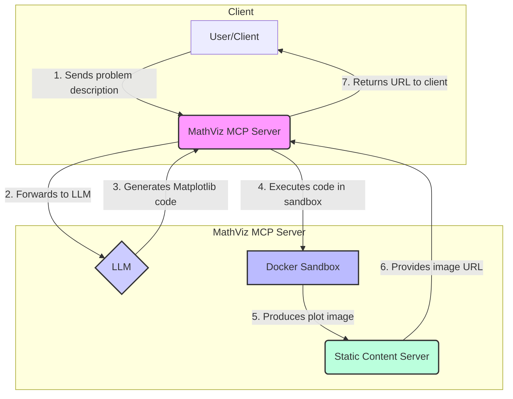

# MathViz - Visualize Math Problems with AI

[](https://opensource.org/licenses/MIT)

**MathViz** is a service based on the Model Context Protocol (MCP) that transforms mathematical problem descriptions into visualizations. It leverages a Large Language Model (LLM) to generate Matplotlib plotting code, executes it in a secure Docker sandbox, and serves the resulting image via a static web server.

## How It Works



## Core Features

- **AI-Powered Visualization**: Uses an LLM to automatically generate Python Matplotlib code from a problem description.
- **Secure Execution**: Code is executed in a sandboxed Docker container with network access disabled and resource limits enforced.
- **Flexible Transport**: Supports both SSE (Server-Sent Events) for web clients and stdio for local applications.
- **Easy Deployment**: Can be run directly or using a pre-built Docker image for consistency.
- **Static Serving**: Generated images are exposed through a built-in static server for easy access.

## Project Structure

```
MathViz/
├── Dockerfile
├── requirements.txt
├── server/
│   ├── __init__.py
│   └── main.py
└── public/
    └── images/      # Generated at runtime
```

## Quick Start

### Prerequisites

- Python 3.10+
- Docker (Docker Desktop is recommended on Windows)

### 1. Installation

Clone the repository and use a virtual environment to install the required Python dependencies:

```bash
git clone https://github.com/Misty-Star/MathViz.git
cd MathViz
uv venv
source .venv/bin/activate  # On Windows, use `.venv\Scripts\activate`
uv pip install -r requirements.txt
```

> **Note**: If `uv` is not installed, please use `pip install uv` to install it.

### 2. Build Docker Image (Recommended)

For a stable and isolated execution environment, build the Docker image:

```bash
docker build -t mathviz-runner:latest .
```

### 3. Configure Environment

Create a `.env` file in the project root to store your configuration. You can also specify a different path using the `MCP_ENV_FILE` environment variable.

**`.env` example:**

```dotenv
# Your OpenAI-compatible API Key
OPENAI_API_KEY=your_api_key_here

# Optional: Custom base URL for OpenAI-compatible gateway
# OPENAI_BASE_URL=https://your.gateway.com

# Model to use for code generation
OPENAI_MODEL=gpt-4o-mini

# Use the pre-built Docker image
MCP_DOCKER_IMAGE=mathviz-runner:latest
MCP_DOCKER_INSTALL_DEPS=false

# Server binding and public URL configuration
# For local development:
# MCP_SSE_HOST=127.0.0.1
# MCP_SSE_PORT=8787

# For server deployment with public access:
# MCP_SSE_HOST=0.0.0.0  # Bind to all interfaces
# MCP_SSE_PORT=8787
# MCP_PUBLIC_BASE_URL=http://YOUR_PUBLIC_IP:8787  # Public URL for image access
# 
# Alternative: specify public host/port separately
# MCP_PUBLIC_HOST=YOUR_PUBLIC_IP
# MCP_PUBLIC_PORT=8787

# Optional: Set log level (DEBUG, INFO, WARNING, ERROR)
# MCP_LOG_LEVEL=DEBUG

# Optional: Configure image output and cleanup
# MCP_IMAGE_FORMAT=svg
# MCP_IMAGES_RETENTION_DAYS=3
# MCP_IMAGES_CLEAN_INTERVAL_SEC=600
```

### 4. Run the Server

The server supports two transport protocols:

- **SSE (Server-Sent Events)**: Default and recommended for web-based clients.
- **stdio (Standard I/O)**: Fallback for local clients if HTTP dependencies are not met.

To start the server in SSE mode:

```bash
uv run python -m server.main
```

The server will be available at `http://127.0.0.1:8787` (or as configured).

- **SSE Endpoint**: `GET /sse`
- **Message Endpoint**: `POST /messages`
- **Image Access**: `GET /images/{image-id}.png`

## Server Deployment

### Public Server Setup

For deploying on a server with public access:

1. **Configure for public access**:
   ```bash
   # .env
   MCP_SSE_HOST=0.0.0.0  # Bind to all network interfaces
   MCP_SSE_PORT=8787
   MCP_PUBLIC_BASE_URL=http://YOUR_PUBLIC_IP:8787
   ```

2. **Alternative configuration**:
   ```bash
   # .env
   MCP_SSE_HOST=0.0.0.0
   MCP_PUBLIC_HOST=YOUR_PUBLIC_IP
   MCP_PUBLIC_PORT=8787
   ```

3. **With domain and HTTPS**:
   ```bash
   # .env
   MCP_SSE_HOST=0.0.0.0
   MCP_PUBLIC_BASE_URL=https://yourdomain.com
   ```

**Note**: The server binds to `0.0.0.0` for public access but returns URLs with the correct public IP/domain configured via `MCP_PUBLIC_BASE_URL` or `MCP_PUBLIC_HOST`.

## Configuration Details

### Environment Variables

| Variable                  | Description                                                                                             | Default                                  |
| ------------------------- | ------------------------------------------------------------------------------------------------------- | ---------------------------------------- |
| `OPENAI_API_KEY`          | **Required.** API key for the LLM service.                                                              | -                                        |
| `OPENAI_BASE_URL`         | Custom gateway for the OpenAI-compatible API.                                                           | -                                        |
| `OPENAI_MODEL`            | The language model to use for code generation.                                                          | `gpt-4o-mini`                            |
| `MCP_SSE_HOST`            | Host for the SSE and static asset server.                                                               | `127.0.0.1`                              |
| `MCP_SSE_PORT`            | Port for the SSE and static asset server.                                                               | `8787`                                   |
| `MCP_PUBLIC_HOST`         | Public host/IP for generating accessible URLs (when different from binding host).                      | Same as `MCP_SSE_HOST`                   |
| `MCP_PUBLIC_PORT`         | Public port for generating accessible URLs (when different from binding port).                         | Same as `MCP_SSE_PORT`                   |
| `MCP_PUBLIC_BASE_URL`     | Complete public base URL (e.g., `https://yourdomain.com` or `http://1.2.3.4:8787`). Overrides host/port settings. | -                                        |
| `MCP_DOCKER_IMAGE`        | The Docker image to use for the sandbox.                                                                | `python:3.11-slim`                       |
| `MCP_DOCKER_INSTALL_DEPS` | If `true`, installs dependencies at runtime. Set to `false` when using a pre-built image.               | Auto-detected                            |
| `MCP_ENV_FILE`            | Path to the environment variable file.                                                                  | `.env` in the project root               |
| `MCP_LOG_LEVEL`           | Logging level (`DEBUG`, `INFO`, `WARNING`, `ERROR`).                                                    | `INFO`                                   |
| `MCP_IMAGE_FORMAT`        | Output format for generated images (`png`, `svg`, `jpg`, `pdf`).                                        | `png`                                    |
| `MCP_IMAGES_RETENTION_DAYS` | How many days to keep generated images before deleting them.                                            | `7`                                      |
| `MCP_IMAGES_CLEAN_INTERVAL_SEC` | Interval in seconds for running the old image cleanup task.                                             | `3600`                                   |
| `MCP_DIRECT_SAVE_IMAGES`  | If `true`, saves images directly to the public directory to avoid a move operation.                   | `false`                                  |

## Tool Definition

The server exposes one primary tool via MCP:

- **`render_plot(problem: str)`**:
  - **Input**: A string containing the mathematical problem description.
  - **Output**:
    - Success: `{"url": "<image-url>", "note": "<additional-info>"}`
    - Failure: `{"error": "<error-message>"}`

## Security Considerations

- **Sandboxing**: The execution environment is isolated within a Docker container.
- **Resource Limiting**: The container is run with restricted CPU, memory, and process counts.
- **Network Disabled**: Network access from within the container is disabled to prevent external calls.
- **Code Sanitization**: The LLM-generated code is sanitized to block certain keywords and enforce the use of the `Agg` backend for non-interactive plotting.

## Notes for Windows Users

- **Docker Path Mounting**: The code automatically handles path translations for Docker volume mounts on Windows (e.g., `E:\...` becomes `/e/...`).
- **File Sharing**: Ensure your drive is shared with Docker Desktop (Settings -> Resources -> File Sharing).
