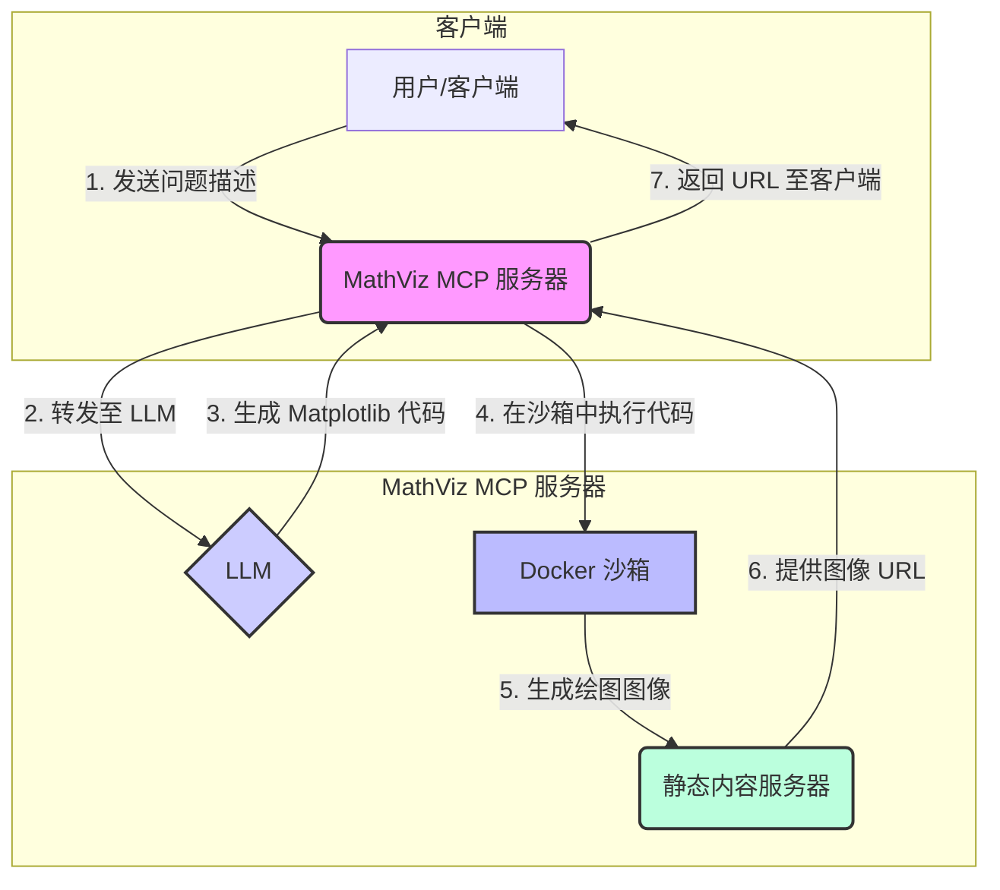

# MathViz - 使用 AI 可视化数学问题

[](https://opensource.org/licenses/MIT)

**MathViz** 是一个基于模型上下文协议 (MCP) 的服务，可将数学问题描述转换为可视化图形。它利用大型语言模型 (LLM) 生成 Matplotlib 绘图代码，在安全的 Docker 沙箱中执行，并通过静态 Web 服务器提供最终生成的图像。

## 工作流程



## 核心特性

- **AI 驱动的可视化**: 使用 LLM 根据问题描述自动生成 Python Matplotlib 代码。
- **安全执行**: 代码在沙箱化的 Docker 容器中执行，禁用了网络访问并强制执行资源限制。
- **灵活的传输协议**: 同时支持用于 Web 客户端的 SSE (服务器发送事件) 和用于本地应用程序的 stdio。
- **轻松部署**: 可直接运行或使用预构建的 Docker 镜像以保证环境一致性。
- **静态文件服务**: 生成的图像通过内置的静态服务器提供，方便访问。

## 项目结构

```
MathViz/
├── Dockerfile
├── requirements.txt
├── server/
│   ├── __init__.py
│   └── main.py
└── public/
    └── images/      # 运行时生成
```

## 快速入门

### 前提条件

- Python 3.10+
- Docker (Windows 上推荐使用 Docker Desktop)

### 1. 安装

克隆仓库并使用虚拟环境安装所需的 Python 依赖项：

```bash
git clone https://github.com/Misty-Star/MathViz.git
cd MathViz
uv venv
source .venv/bin/activate  # Windows 上使用 `.venv\Scripts\activate`
uv pip install -r requirements.txt
```

> **注意**: 如果没有安装 uv，请使用 `pip install uv` 安装。

### 2. 构建 Docker 镜像 (推荐)

为了获得稳定且隔离的执行环境，请构建 Docker 镜像：

```bash
docker build -t mathviz-runner:latest .
```

### 3. 配置环境

在项目根目录下创建一个 `.env` 文件来存储您的配置。您也可以通过 `MCP_ENV_FILE` 环境变量指定不同的文件路径。

**`.env` 文件示例:**

```dotenv
# 您的 OpenAI 兼容 API 密钥
OPENAI_API_KEY=your_api_key_here

# 可选：自定义 OpenAI 兼容网关的基础 URL
# OPENAI_BASE_URL=https://your.gateway.com

# 用于代码生成的模型
OPENAI_MODEL=gpt-4o-mini

# 使用预构建的 Docker 镜像
MCP_DOCKER_IMAGE=mathviz-runner:latest
MCP_DOCKER_INSTALL_DEPS=false

# 可选：为 SSE 和静态资源自定义主机和端口
# MCP_SSE_HOST=127.0.0.1
# MCP_SSE_PORT=8787

# 可选：设置日志级别 (DEBUG, INFO, WARNING, ERROR)
# MCP_LOG_LEVEL=DEBUG
```

### 4. 运行服务器

服务器支持两种传输协议：

- **SSE (服务器发送事件)**: 默认且推荐用于 Web 客户端。
- **stdio (标准输入/输出)**: 如果未满足 HTTP 依赖，则回退用于本地客户端。

以 SSE 模式启动服务器：

```bash
uv run python -m server.main
```

服务器将在 `http://127.0.0.1:8787` (或根据配置的地址) 上可用。

- **SSE 端点**: `GET /sse`
- **消息端点**: `POST /messages`
- **图像访问**: `GET /images/{image-id}.png`

## 配置详情

### 环境变量

| 变量名                  | 描述                                                                       | 默认值                                   |
| ------------------------- | -------------------------------------------------------------------------- | ---------------------------------------- |
| `OPENAI_API_KEY`          | **必需.** LLM 服务的 API 密钥。                                            | -                                        |
| `OPENAI_BASE_URL`         | OpenAI 兼容 API 的自定义网关。                                             | -                                        |
| `OPENAI_MODEL`            | 用于代码生成的语言模型。                                                   | `gpt-4o-mini`                            |
| `MCP_SSE_HOST`            | SSE 和静态资源服务器的主机。                                               | `127.0.0.1`                              |
| `MCP_SSE_PORT`            | SSE 和静态资源服务器的端口。                                               | `8787`                                   |
| `MCP_DOCKER_IMAGE`        | 用于沙箱的 Docker 镜像。                                                   | `python:3.11-slim`                       |
| `MCP_DOCKER_INSTALL_DEPS` | 若为 `true`，则在运行时安装依赖。使用预构建镜像时设为 `false`。            | 自动检测                                 |
| `MCP_ENV_FILE`            | 环境变量文件的路径。                                                       | 项目根目录下的 `.env`                    |
| `MCP_LOG_LEVEL`           | 日志级别 (`DEBUG`, `INFO`, `WARNING`, `ERROR`)。                           | `INFO`                                   |

## 工具定义

服务器通过 MCP 提供一个主要工具：

- **`render_plot(problem: str)`**:
  - **输入**: 包含数学问题描述的字符串。
  - **输出**:
    - 成功: `{"url": "<image-url>", "note": "<additional-info>"}`
    - 失败: `{"error": "<error-message>"}`

## 安全考量

- **沙箱化**: 执行环境被隔离在 Docker 容器内。
- **资源限制**: 容器运行时限制了 CPU、内存和进程数量。
- **网络禁用**: 禁止容器内部的网络访问，以防止外部调用。
- **代码净化**: 对 LLM 生成的代码进行净化，以阻止某些关键字并强制使用 `Agg` 后端进行非交互式绘图。

## Windows 用户注意事项

- **Docker 路径挂载**: 代码会自动处理 Windows 上 Docker 卷挂载的路径转换 (例如, `E:\...` 变为 `/e/...`)。
- **文件共享**: 请确保您的驱动器已与 Docker Desktop 共享 (Settings -> Resources -> File Sharing)。
